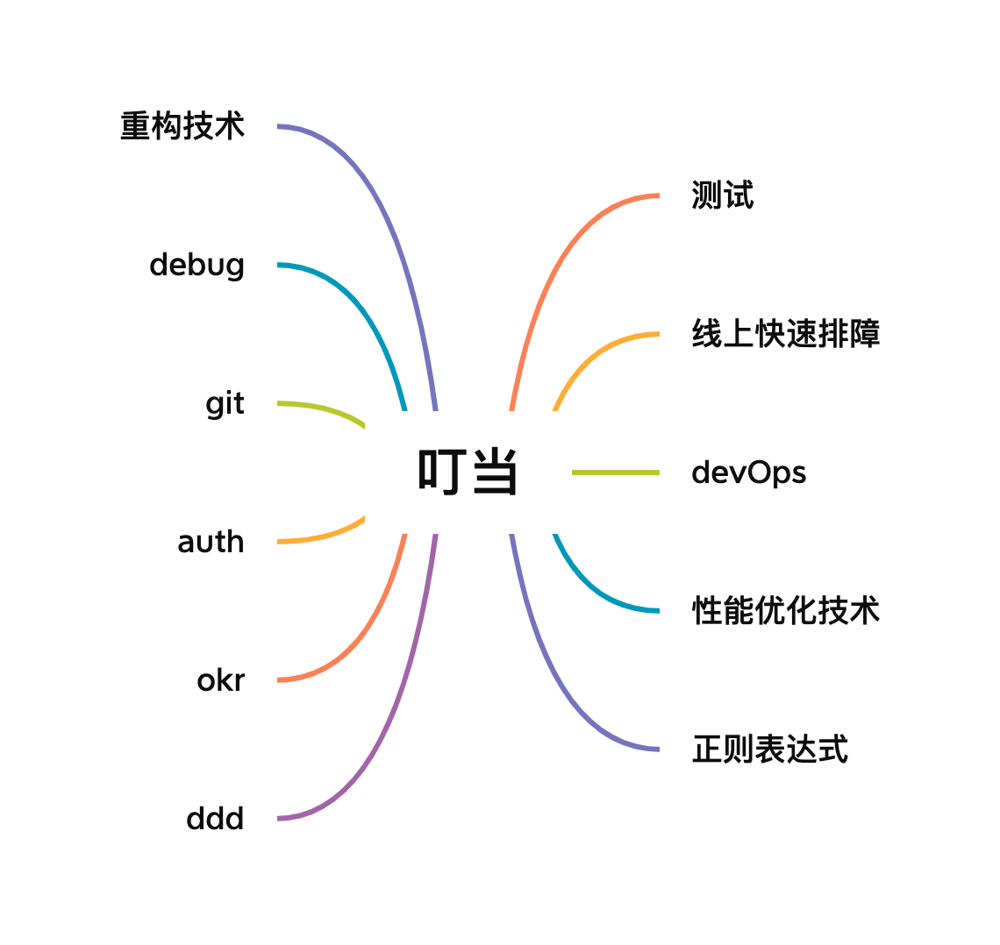

<!--
 * @Author: shgopher shgopher@gmail.com
 * @Date: 2022-12-29 23:11:24
 * @LastEditors: shgopher shgopher@gmail.com
 * @LastEditTime: 2024-03-14 17:39:55
 * @FilePath: /dingdang/README.md
 * @Description: 
 * 
 * Copyright (c) 2023 by shgopher, All Rights Reserved. 
-->
# 叮当

hey~，我是科科人神，目前就职于国内一家互联网公司，你们可以加我<a href="#wechat.png">微信</a>，交个朋友吧~

 

添加微信公众号：<a href="#wechat.png">科科人神</a>, 回复：

- `面试题`，获取经典 go 面试大全。
- `好友`，可以添加作者的微信好友

                              
## Git
- [git 的基本概念](./git/基本概念)
- [git 的基本配置](./git/基本配置)
- [git 的基本操作](./git/基本操作)              
- [git 的多人合作模式](./git/多人合作模式)
- [git 多人合作模式实操](./git/多人合作模式实操)
- [git 工具](./git/工具)
- [自定义 git](./git/自定义)
- [github 的使用](./git/github)
- [gitlab 的使用](./git/gitlab)
- [git 的底层原理](./git/底层原理)
- [git 的实际应用](./git/实际应用)
## homebrew
- [homebrew 注意事项](./homebrew/注意事项/README.md)
## julia
## Makefile
- [Makfile 的基本概念](./makefile-p/基本概念/README.md)
## 正则表达式
## devOps
## okr
## auth
## 重构技术
## 性能优化技术
## debug 技术
## 线上快速排障
## 测试
## 小工具
- [代码统计工具 cloc](./small/cloc)

## 更多内容
> 👷 正在施工中...

- [GOFamily](https://github.com/shgopher/GOFamily) go 后端程序员宝典：go 基础语法，go 底层数据结构，go runtime 实现原理，go 并发模式，go 语言项目经验
- [408](https://github.com/shgopher/408) 关于 408 的相关知识，例如算法数据结构，网络，操作系统，数据库等。
- [luban](https://github.com/shgopher/luban) 系统设计相关内容，例如分布式共识算法，消息队列，容器，RPC 等内容。
- [dingdang](https://github.com/shgopher/dingdang) 各种工具类的使用，例如 git，正则表达式，ddd，CI/CD 等内容。
- [god](https://github.com/shgopher/god) 关于程序员自身的一些看法，例如面试经历，赚钱窍门，创业门道，如何向上
管理等。
- [RustFamily](https://github.com/shgopher/RustFamily) rust 基础知识，rust 并发编程，rust 项目实践，rust 底层原理。
## 参考资料
- [玩转 Git 三剑客](https://time.geekbang.org/course/intro/100021601)
- [Pro Git](https://git-scm.com/book/zh/v2)
- [Go 语言项目开发实战](https://time.geekbang.org/column/article/390401?cid=100079601)
- [左耳听风](https://time.geekbang.org/column/article/2440)
- [正则表达式入门课](https://time.geekbang.org/column/intro/100053301)

## 扫一扫添加我的公众号，回复 “加群”，可以加入微信群。

 
 

                                                                             
## star
                                                                             

